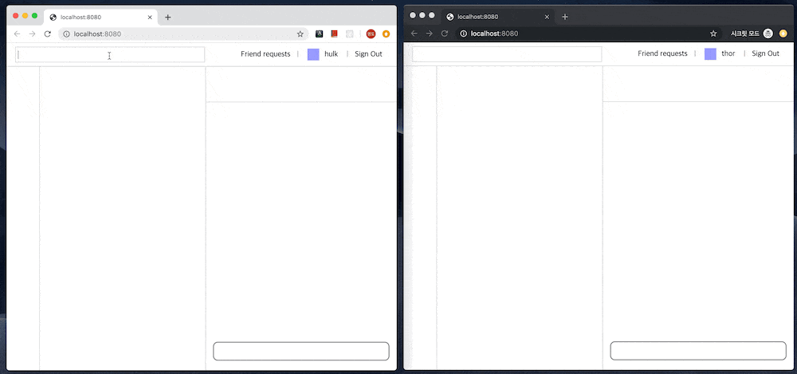

# EasychatJS
Javascript SDK to build web chat



## Table of Contents
* [Getting Started](#getting-started)
* [API Reference](#api-reference)
  * [Easychat](#easychat)
  * [CurrentUser](#currentuser)

## Getting Started
1. Sign in to the [easychatJS website](https://easychatjs.com/auth/signin).
    * If you don't have a account yet, sign up [here](https://easychatjs.com/auth/signup).
2. Create a project on the easychatJS dashboard.
3. Copy project's api key.
4. Insert this code to the bottom of your &lt;body&gt; tag, but before you use EasychatJS service.
```html
<script src="https://easychatjs.com/sdk/easychat.js"></script>
<script>
  const easychat = new Easychat({
    apiKey: 'PROJECT_API_KEY',
  });

  easychat.initializeApp().catch((error) => {
    console.log(error);
  })
</script>
```
5. That's all it takes to load easychatJS SDK. Build your messenger by using api references below!

## API Reference

### Easychat
To get started with easychat, you should instantiate `Easychat` instance. When instantiating, project api key is required.
```javascript
const easychat = new Easychat({
  apiKey: 'PROJECT_API_KEY',
});
```
#### Methods

**constructor**
```javascript
new Easychat(options)
```
Creates new easychat instance.

*arguments*
* options
    * options.apiKey: String - project api key

**easychat.initializeApp()**
```javascript
easychat.initializeApp()
  .then((currentUser) => {
    if(!currentUser) ...
  })
  .catch((error) => {
    ...
  })
```
Finds project by using api key and initialize easychat with found project asynchronously. It returns pending promise. When api key is correct, the promise is fulfilled with value(currentUser or null). If browser has cookie including logined user information, currentUser is supplied. This is useful for page reload. When api key is not correct, the promise is rejected with error object including message.

*returns*
* Promise
  * resolve([currentUser])
  * reject(error)

**easychat.createUser(email, password, nickname)**
```javascript
easychat.createUser(email, password, nickname)
  .then((currentUser) => {
    ...
  })
  .catch((error) => {
    ...
  })
```
Creates user to use with easychat service. It returns pending promise. When user is created successfully, the promise is fulfilled with currentUser. Otherwise, it is rejected with error.

*arguments*
* email: String - unique string value
* password: String
* nickname: String

*returns*
* Promise
  * resolve(currentUser)
  * reject(error)

**easychat.signIn(email, password)**
```javascript
easychat.signIn(email, password)
  .then((currentUser) => {
    ...
  })
  .catch((error) => {
    ...
  })
```
Signs in existing user. It returns pending promise. When signing in correctly, the promise is fulfilled with currentUser. Otherwise, it is rejected with error including some reason.

*arguments*
* email: String
* password: String

*returns*
* Promise
  * resolve(currentUser)
  * reject(error)

**easychat.signOut()**
```javascript
easychat.signOut()
  .catch((error) => {
    ...
  })
```

Signs out current user.

*returns*
* Promise
  * reject(error)

**easychat.getUsers(field, value)**
```javascript
easychat.getUsers(field, value)
  .then((users) => {
    ...
  })
  .catch((error) => {
    ...
  })
```
Finds users with field-value pair. Make sure that you can't use other values to field argument except 'email' or 'nickname'

*arguments*
* field: String - 'email' | 'nickname'
* value: String|RegExp

*returns*
* Promise
  * resolve(users): array of User
  * reject(error)

**easychat.getRoom(id)**
```javascript
easychat.getRoom(id)
  .then((room) => {
    ...
  })
  .catch((error) => {

  })
```
Finds room with room id. If it fails to find room with id, a promise is fulfilled with undefined.

*arguments*
* id: String - room id

*returns*
* Promise
  * resolve(room)
  * reject(error)

### CurrentUser

CurrentUser is a object that indicates logined user. It is passed in resolve argument of `easychat.initializeApp()`, `easychat.createUser()`, `easychat.signin()`.

#### Methods

**currentUser.onFriendRequested(callback)**
```js
currentUser.onFriendRequested((friendRequest) => {
  ...
})
```
Binds event handler to be called when someone requests friend to you. Callbacks will be invoked with friendRquest object.

*arguments*
* callback: Function - event handler

**currentUser.onFriendAdded(callback)**
```js
currentUser.onFriendAdded((user) => {
  ...
})
```
Binds event handler to be called when user gets a friend. Callbacks will be invoked with user object.

*arguments*
* callback: Function - event handler

**currentUser.onFriendPresenceChanged(callback)**
```js
currentUser.onFriendPresenceChanged((user) => {
  ...
})
```
Binds event handler to be called when friend presence state is changed(login or logout). Callbacks will be invoked with user object.

*arguments*
* callback: Function - event handler

**currentUser.onFriendRemoved(callback)**
```js
currentUser.onFriendRemoved((user) => {
  ...
})
```
Binds event handler to be called when friend is removed. Callbacks will be invoked with user object.

*arguments*
* callback: Function - event handler

**currentUser.onRoomAdded(callback)**
```js
currentUser.onRoomAdded((room) => {
  ...
})
```
Binds event handler to be called when user joined a room. Callbacks will be invoked with room object.

*arguments*
* callback: Function - event handler

**currentUser.onMessage(callback)**
```js
currentUser.onMessage((message) => {
  ...
})
```
Binds event handler to be called when user receives a message. Callbacks will be invoked with message object.

*arguments*
* callback: Function - event handler

**currentUser.onRoomRemoved(callback)**
```js
currentUser.onRoomRemoved((room) => {
  ...
})
```
Binds event handler to be called when user exit a room. Callbacks will be invoked with room object.

*arguments*
* callback: Function - event handler

**currentUser.onRoomUpdated(callback)**
```js
currentUser.onRoomUpdated((room) => {
  ...
})
```
Binds event handler to be called when room state is changed. Callbacks will be invoked with room object.

*arguments*
* callback: Function - event handler

**currentUser.requestFriend(id)**
```js
currentUser.requestFriend(id);
```
Requests user to be friend.

*arguments*
* id: String - user id who user want to be as friend

**currentUser.responseFriendrequest(id, answer)**
```js
currentUser.responseFriendrequest(id, answer);
```
Responses friend request with answer.

*arguments*
* id: String - frientRequest id
* answer: 'accept' | 'decline' - user's answer

**currentUser.getFriendrequests()**
```js
currentUser.getFriendrequests().then((friendRequests) => {
  ...
});
```
Gets all friendrequests.

*returns*
* Promise
  * resolve(frientrequests) - array of friend requests
  * reject(error)

**currentUser.getFriends(sortOption)**
```js
currentUser.getFriends(sortOption).then((friends) => {
  ...
});
```
Gets all friends sorted by option.

*arguments*
* sortOption
  * sortOption.email: 'asc' | 'desc'
  * sortOption.nickname: 'asc' | 'desc'
  * sortOption.isPresent: 'asc' | 'desc'

*returns*
* Promise
  * resolve(friends) - array of friends
  * reject(error)

**currentUser.getRooms()**
```js
currentUser.getRooms().then((rooms) => {
  ...
});
```
Gets all rooms that user has participated in.

*returns*
* Promise
  * resolve(rooms) - array of rooms
  * reject(error)

**currentUser.removeFriend(id)**
```js
currentUser.removeFriend(id);
```
Removes friend using id.

*arguments*
* id: String - friend id to remove

**currentUser.createRoom(roomOptions)**
```js
currentUser.createRoom(roomOptions);
```
Creates room with room options.

*arguments*
* roomOptions: object

**currentUser.sendMessage({roomId, text})**
```js
currentUser.sendMessage({roomId, text});
```
Sends message to room.

*arguments*
* options
  * options.roomId: String - room id
  * options.text: String - message text


**currentUser.openRoom({roomId, hooks})**
```js
currentUser.openRoom({roomId, hooks});
```
Opens room and register event handler to the room.

*arguments*
* options
  * options.roomId: String - room id
  * options.hooks: Object

**currentUser.closeRoom(roomId)**
```js
currentUser.closeRoom(roomId});
```
Closes room and remove all hooks.

*arguments*
* roomId: String - room id

**currentUser.leaveRoom(roomId)**
```js
currentUser.leaveRoom(roomId);
```
Leaves room permanently.

*arguments*
* roomId: String - room id

**currentUser.addUsersToRoom({roomId, userIds})**
```js
currentUser.addUsersToRoom({roomId, userIds});
```
Invites users to room.

*arguments*
* options
  * options.roomId: String - room id
  * options.userIds: Array - array of user id